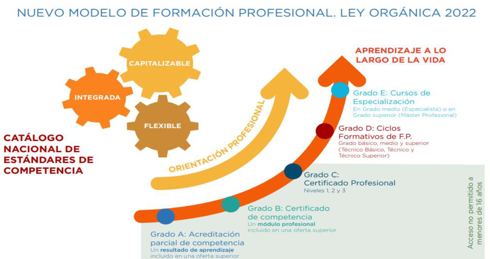
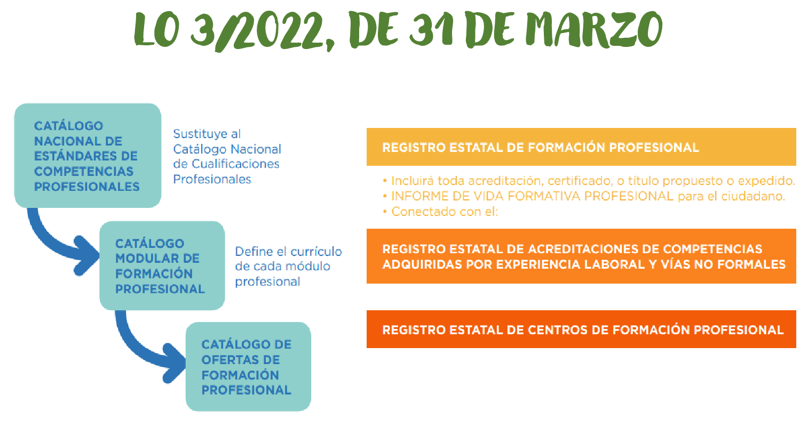
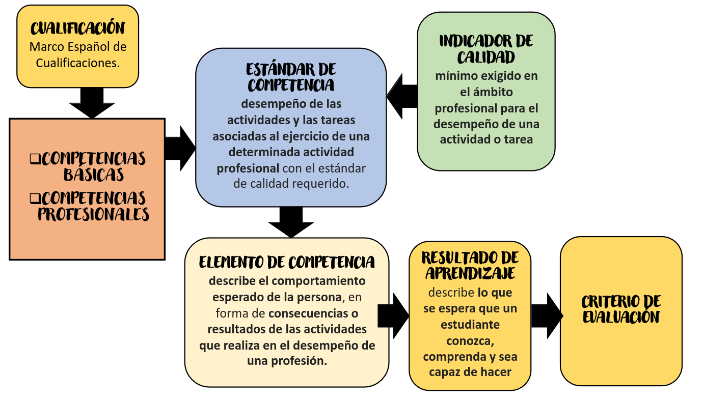
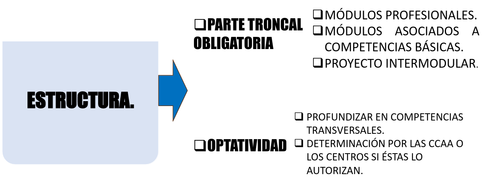
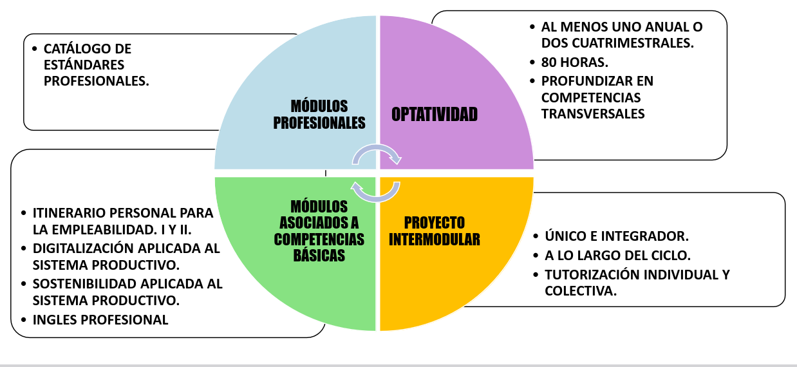
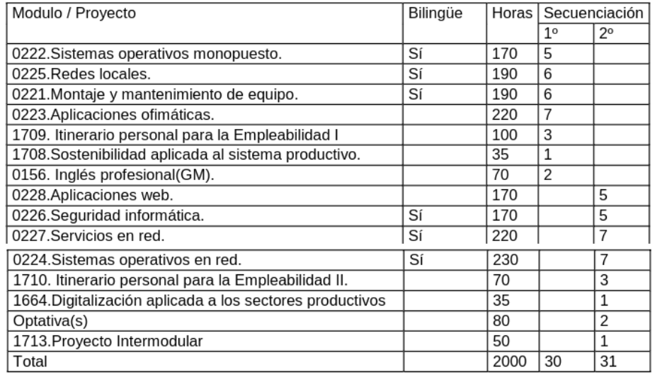
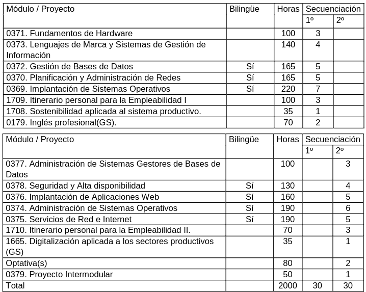

# Nueva FP

## Marco normativo

* **Ley Orgánica 3/2022, de 31 de marzo**, de ordenación e integración de la Formación Profesional. [Enlace](https://www.boe.es/diario_boe/txt.php?id=BOE-A-2022-5139).
* **Real Decreto 659/2023, de 18 de julio**, por el que se desarrolla la ordenación del sistema de la Formación Profesional. [Enlace](https://www.boe.es/diario_boe/txt.php?id=BOE-A-2023-16889).

## Nuevo modelo

* **Catálogo Nacional de Estándares de Competencia**:
    * **Grado A**: Acreditación parcial de competencia (Resultado de Aprendizaje).
    * **Grado B**: Certificado de competencia (Módulo profesional).
    * **Grado C**: Certificados Profesional (Niveles 1,2 y 3).
    * **Grado D**: Ciclos Formativos (Grado básico, medio y superior).
    * **Grado E**: Curso de Especialización (Especialista (GM) y Máster Profesional (GS)).

* Todos los ciclos formativos se desarrollarán, **con carácter dual**, entre el centro de formación y la empresa, incluyendo una fase de formación en empresa, de acuerdo con lo establecido en el Título III de la ley Orgánica de Formación Profesional.

* **Catálogo Nacional de Estándares de Competencias Profesionales**: modifica el actual Catálogo Nacional de Cualificaciones Profesionales.
    * Los estándares de competencia **se organizarán por familias profesionales y por niveles** en función de la complejidad de las tareas que describen.
    * **Estándar de competencia**: Conjunto detallado de elementos de competencia que **describen el desempeño de las actividades y las tareas asociadas al ejercicio de una determinada actividad profesional** con el estándar de calidad requerido. Será la unidad o **elemento de referencia para diseñar, desarrollar y actualizar ofertas de formación profesional**.
* **Catálogo Nacional de Ofertas de Formación Profesional**: incluye, por vez primera, todas aquellas que pueden cursarse en nuestro país en el marco de la formación profesional, desde las más amplias a las más reducidas o microformaciones.
* **Catálogo Modular de Formación Profesional**: para dotar de agilidad los cambios y adaptaciones permanentes que requiere una formación actualizada.

* **Cualificación**: La competencia para el **desempeño de una actividad profesional acreditada oficialmente por títulos, certificados o acreditaciones**. (Marco Español de las Cualificaciones (MECU)).
* **Elemento de Competencia**: cada realización profesional que **describe el comportamiento esperado de la persona, en forma de consecuencias o resultados de las actividades que realizan el desempeño de una profesión**.
    * **Competencias básicas**: Aquellas que son consideradas necesarias **para la realización y desarrollo personal, para participar activamente en la sociedad o mejorar la empleabilidad**.
    * **Competencia profesional**: Conjunto de conocimientos y destrezas que permiten el ejercicio de la actividad profesional conforme a las exigencias dela producción y el empleo. **Se
recogen en los estándares de competencia profesional**.
* **Indicador de Calidad**: el criterio que establece el **nivel mínimo exigido en el ámbito profesional para el desempeño de una actividad o tarea**, en tanto que satisface los objetivos de las organizaciones productivas. 
* **Resultado de aprendizaje**: elemento básico del currículo que describe **lo que se espera que un estudiante conozca, comprenda y sea capaz de hacer**, asociado a un elemento de competencia y que orienta el resto de elementos curriculares, incluidos los criterios de evaluación.
* Existen:
    * Módulo profesional asociado a estándares de competencia
    * Módulo profesional **no** asociado a estándares de competencia

## Evaluación

* Las ofertas de formación profesional contarán con una evaluación que verifique la **adquisición de los resultados de aprendizaje** en las condiciones de calidad establecidas en los elementos básicos del currículo.
* La evaluación **respetará las necesidades de adaptación metodológica y de recursos de las personas con necesidades específicas de apoyo educativo o formativo**.
* El **sistema de evaluación de cualquier oferta** incluida en el Sistema de Formación Profesional **se adaptará a las diferentes metodologías de aprendizaje, y deberá basarse en la comprobación de los resultados de aprendizaje**.
* En el caso de **ofertas dirigidas a la población activa**, el sistema de evaluación de las mismas tendrá **en consideración las características propias de estas personas** y el carácter práctico de esta formación.

## Ciclos Formativos (Grado D)

* Ciclos formativos de grado medio, con carácter general, los vinculados a estándares de competencia de nivel 2 del Catálogo Nacional de Estándares de Competencias Profesionales.
* Ciclos formativos de grado superior, con carácter general, los vinculados a estándares de competencia de nivel 3 del Catálogo Nacional de Estándares de Competencias Profesionales.

### Nuevo Módulos

* **Proyecto intermodular**: Ciclos formativos de **grado medio y superior**, el proyecto intermodular podrá tener **carácter anual o bienal, con una duración mínima de 25 horas en cada curso y deberá defenderse ante el equipo docente**, al que, en su caso, podrá incorporarse el **tutor o tutora de empresa**.
    * Carácter integrador de los conocimientos incorporados en los módulos profesionales que configuran el ciclo formativo, con especial atención a los elementos de **búsqueda de información, innovación, investigación aplicada y emprendimiento**, vinculados a los resultados de aprendizaje de aquél.
    * Existirá un seguimiento y tutorización individual y colectiva del proyecto, que **se desarrollará de forma simultánea al resto de los módulos profesionales** a lo largo de la duración del ciclo formativo.
* **Itinerario Personal para la Empleabilidad**: desarrollo de un **plan personalizado de acompañamiento y orientación educativa, profesional y laboral** que permita mejorar la empleabilidad del alumnado.
    * Va a estar presente en el primer y segundo curso de los ciclos formativos de grado medio y superior.
    * Habilidades transversales, Habilidades emprendedoras, Competencias digitales, Autoorientación.

